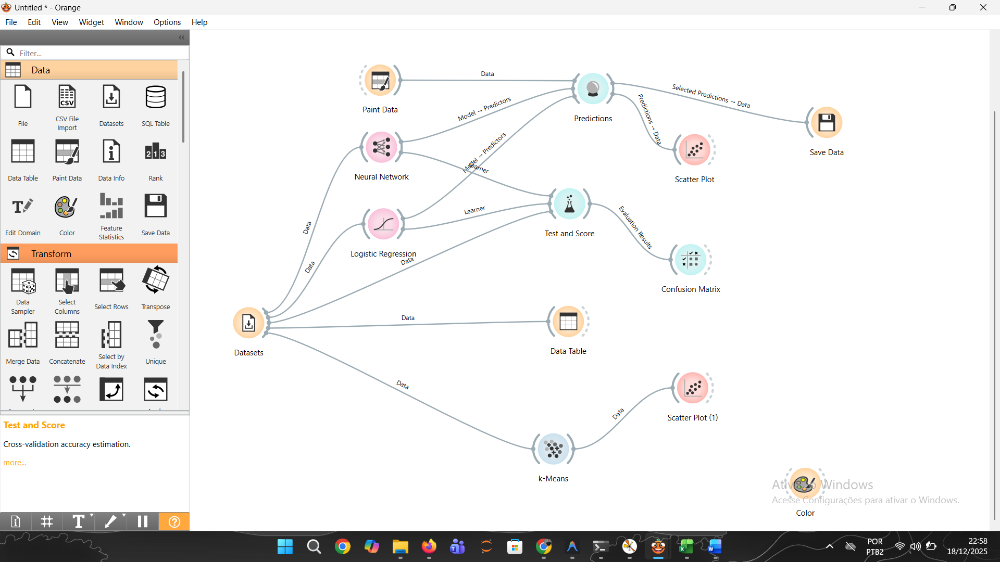
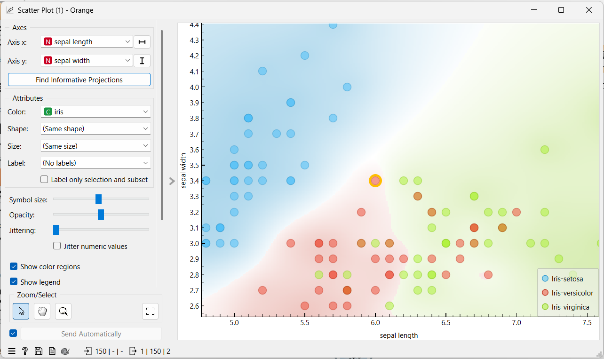

# Iris Classification - Neural Network & Logistic Regression Study

🧠Classificação da Íris: O meu estudo sobre Redes Neurais e Regressão Logística
Neste projeto, decidi explorar como diferentes algoritmos de Inteligência Artificial se comportam ao tentar separar grupos de dados com diferentes níveis de semelhança. Utilizei a base de dados Iris e a ferramenta Orange Data Mining para construir e validar os meus modelos.

📊 Como estruturei o meu experimento
Para começar, montei um fluxo de trabalho (workflow) onde pude visualizar cada etapa, desde a entrada dos dados até à avaliação final. Abaixo podes ver como ficou o desenho do meu processo:

## 📊 Metodologia do Experimento
O fluxo de trabalho (workflow) foi estruturado da seguinte forma:
.

## 🧠 Conclusões Técnicas
Ao analisar o gráfico de dispersão (Scatter Plot), chegamos às seguintes conclusões:

📈 O que os resultados me mostraramPara avaliar se os modelos estavam aprendendo corretamente, utilizei a técnica de Cross-Validation (com 5 folds). Fiquei bastante atento aos indicadores de desempenho e os números que obtive foram estes:ModeloPrecisionRecallF1-ScoreAccuracy (CA)Logistic Regression0.9670.9670.9670.967Neural Network0.9270.9270.9270.927

🧠 A minha conclusão pessoal
Neste estudo, pude perceber que a Regressão Logística acabou por ter um desempenho superior à Rede Neural, chegando a uma acurácia de 96.7%.

Isso me trouxe um aprendizado importante: nem sempre o modelo mais complexo é o melhor para todas as situações. Para este caso específico, com um volume de dados menor e uma separação linear mais clara, o modelo estatístico tradicional mostrou-se muito mais eficiente e preciso.

## 📂 Estrutura do Repositório
- `/images`: Prints do workflow e dos gráficos de resultados.
- `projeto iris.ows`: Arquivo original do Orange com toda a lógica do experimento.
- `Desafio_Iris_Final.xlsx`: Planilha com os dados e as predições finais exportadas.
